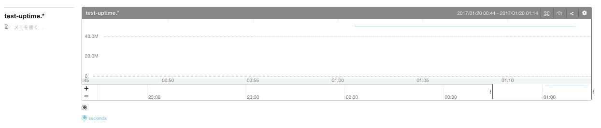

# mackerel-cast-service-metric
Some results of mackerel-agent-plugin casts ServiceMetric.

# Usage

## 1. Setting config.toml file.
```toml
api_key = "xxxxxxxxxxxxx"

[[rule]]
cmd = "mackerel-plugin-linux"
service_name = "web"
metric_name = ""

[[rule]]
cmd = "mackerel-plugin-uptime"
service_name = "web"
metric_name = "test"
```

## 2. Run mackerel-cast-service-metric.
You must install this command from `release` or below:
```shell
$ go get github.com/sioncojp/mackerel-cast-service-metric
$ glide install

$ go run /mackerel-cast-service-metric -c config.toml
or
$ go build cmd/mackerel-cast-service-metric/*.go
$ ./mackerel-cast-service-metric -c config.toml
```

## 3. Check mackerel ServiceMetric graph which service_name in config.toml.

### Result: rule1 [mackerel-plugin-linux]


### Result: rule2 [mackerel-plugin-uptime]
You can be confirmed "test-uptime.\*" because you've set metric_name in config.yml.


